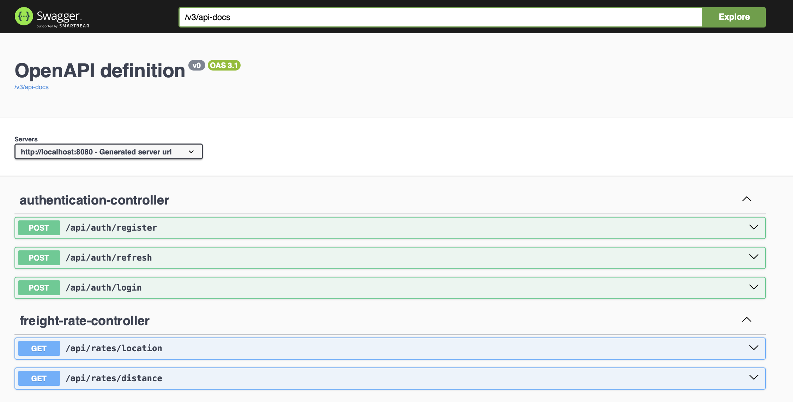
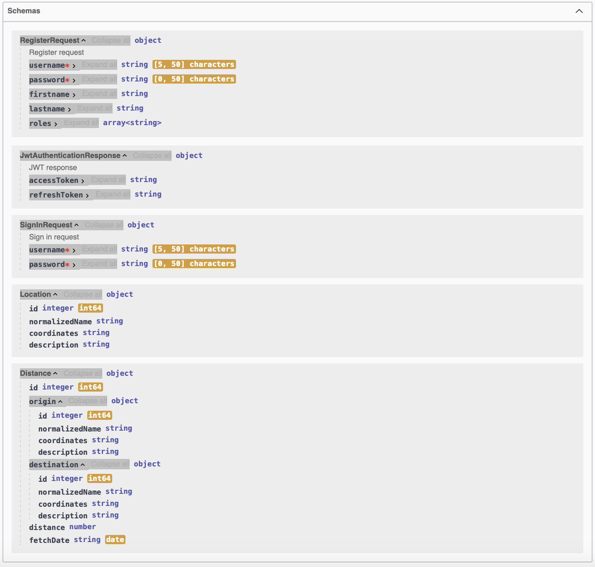
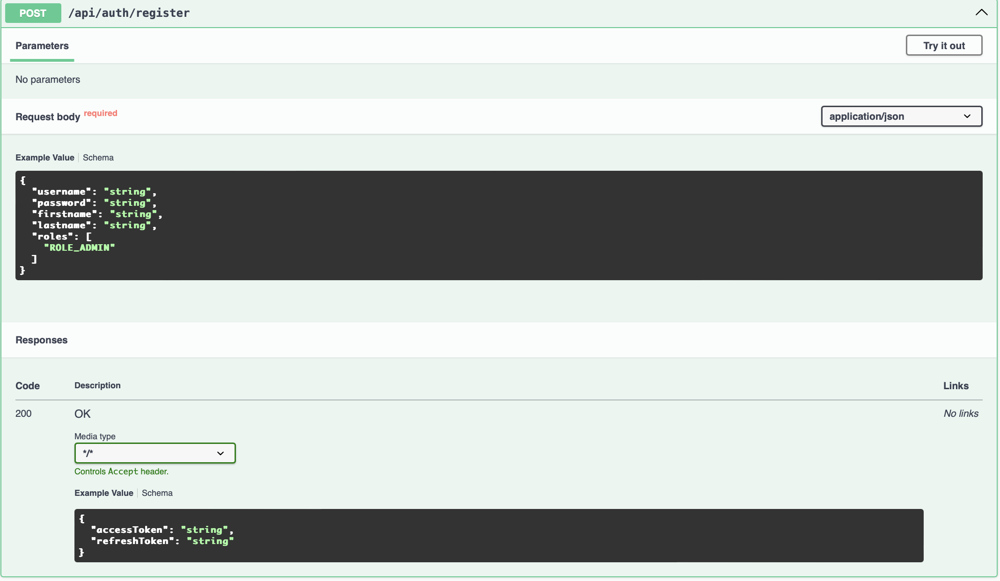
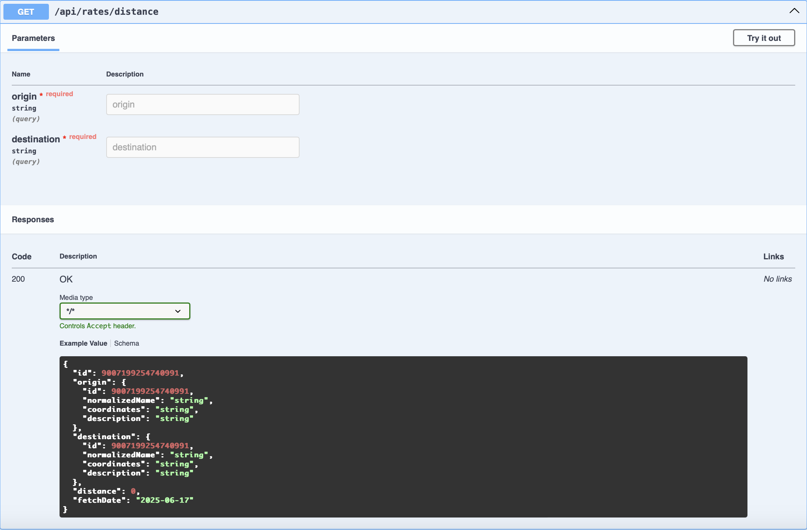

# 🚛 Freight Rate Calculator

**FreightRateCalculator** — это backend-приложение на базе **Spring Boot**, предназначенное для расчёта тарифов грузоперевозок.

---
## 🎯 О проекте
**Pet-проект** разработан как демонстрация практических навыков работы с **Spring Boot** и построения многослойной архитектуры. Основной упор сделан на архитектурную чистоту и безопасность.

### 🧱 Архитектура и слои
- Чёткое разделение на слои:
    - `Controller`, `Service`, `Repository`
    - `DTO`, `Entity`
- Соблюдение принципов:
    - **SOLID**
    - **DRY**
    - **Clean Architecture**

### 🔐 Безопасность

- Полноценная аутентификация и авторизация на основе **Spring Security**
- Реализация **JWT Access** и **Refresh токенов**

### ⚙️ Работа со Spring

- Конфигурация через `application.properties`
- Использование **DTO** и **DAO** для разделения слоёв данных и логики
- Получение и обработка данных через **REST API**
- Применение **Spring WebFlux** для построения реактивных контроллеров

### 📊 Инфраструктура и стабильность

- **Логгирование через AOP (аспекты)**
- **Глобальная обработка ошибок** с использованием `@ControllerAdvice`
- Документация API через **SpringDoc / Swagger UI**
---

## ⚙️ Стек технологий

- **Java 17**
- **Spring Boot 3**
- **Spring WebFlux**
- **Spring Security + JWT (Access/Refresh)**
- **Spring Validation**
- **MapStruct** — преобразование между Entity и DTO
- **Lombok**
- **Spring Data JDBC** (PostgreSQL)
- **OpenAPI (Swagger) via SpringDoc**
- **Docker** — контейнеризация

---

## 📁 Структура проекта

```src
├── main
├── java
│   └── com
│       └── mcube
│           └── FreightRateCalculator
│               ├── aspect           # Логгирование
│               ├── config           # Конфигурационные файлы приложения
│               ├── controller       # REST-контроллеры
│               ├── dto              # DTO для запросов и ответов
│               ├── entity           # Сущности
│               ├── exception        # Глобальная и кастомная обработка ошибок
│               ├── external         # Взаимодействие с внешними сервисами
│               ├── repository       # Репозитории (интерфейсы доступа к данным)
│               ├── service          # Сервисный слой (бизнес-логика)
│               └── security
│                   ├── config       # Конфигурация Spring Security
│                   ├── dto          # DTO, связанные с авторизацией
│                   ├── entity       # Пользователи, роли и т.п.
│                   ├── repository   # Репозитории для сущностей безопасности
│                   └── service      # Сервисы аутентификации и токенов
└── resources
    └── application.properties       # Конфигурация приложения
```

### 🧪 Тестирование

Проект содержит демо-тестирование бизнес-логики unit-тестами.  

Для примера тестируется метод `isCityWordPresent(String address)`, который определяет, содержит ли строка явное указание на город (например, "город", "г.", "Г." и т.п.).

- Покрыты разные регистры (`г.` / `Г.` / `город`)
- Проверяются аббревиатуры и пробелы (`"г.Ташкент"`, `"г. Ташкент"`, `"городТашкент"`)
- Обрабатываются ложные совпадения (например, `"Новгород"`, `"Городище"`, `"город"` без названия)

🧪 Всего >25 кейсов для уверенного поведения метода в разных условиях. Это снижает риск ошибок при парсинге адресов из внешнего источника.


### 📦 API: Работа с локациями и расстоянием

Контроллер `FreightRateController` предоставляет REST-эндпоинты для получения информации о городах и расчета расстояний между ними.

---

#### 🔍 GET `/api/rates/location`

Возвращает информацию о городе на основе его названия.

**Параметры запроса:**

| Параметр  | Тип    | Обязателен | Описание                   |
|-----------|--------|------------|----------------------------|
| cityName  | string | ✅         | Название города            |

**Пример запроса:**
```
GET /api/rates/location?cityName=Москва
```
**Пример ответа:**
```json
{
  "id": 10,
  "normalizedName": "Москва",
  "coordinates": "37.617698 55.755864",
  "description": "Россия, Москва"
}
```

#### 📏 GET `/api/rates/distance`

Рассчитывает расстояние между двумя городами.

**Параметры запроса:**

| Параметр    | Тип    | Обязателен | Описание          |
|-------------|--------|------------|-------------------|
| origin      | string | ✅          | Город отправления |
| destination | string | ✅          | Город назначения  |

**Пример запроса:**
```
GET /api/rates/distance?origin=Маргилан&destination=Москва
```

**Пример ответа:**
```json
{
  "id": 5,
  "origin": {
    "id": 15,
    "normalizedName": "Маргилан",
    "coordinates": "71.720774 40.469065",
    "description": "Узбекистан, Ферганская область, Маргилан"
  },
  "destination": {
    "id": 10,
    "normalizedName": "Москва",
    "coordinates": "37.617698 55.755864",
    "description": "Россия, Москва"
  },
  "distance": 4515.16,
  "fetchDate": [
    2025,
    6,
    16
  ]
}
```

## 🚀 Быстрый старт

### 1. Клонировать репозиторий

```shell
git clone https://github.com/mirsaidmir/FreightRateCalculator.git
cd FreightRateCalculator
```

### 2. Настроить базу данных PostgreSQL
Создайте базу и укажите настройки подключения в `application.properties`

```properties
spring.datasource.url=jdbc:postgresql://localhost:5433/freight
spring.datasource.username={username}
spring.datasource.password={password}
```

### 3. Запустить проект

```shell
./mvnw clean spring-boot:run
```

## 🐳 Docker
```dockerfile
docker build -t freight-rate-calculator .
docker run -p 8080:8080 freight-rate-calculator
```


## 📘 Документация API (Swagger)

В проекте используется [**SpringDoc OpenAPI**](https://springdoc.org/) для генерации Swagger-документации.

### 🔗 Доступ:
После запуска приложения:

- Swagger UI: [http://localhost:8080/swagger-ui.html](http://localhost:8080/swagger-ui.html)
- OpenAPI JSON: [http://localhost:8080/v3/api-docs](http://localhost:8080/v3/api-docs)

### 📦 Зависимость в `pom.xml`:
```xml
<dependency>
  <groupId>org.springdoc</groupId>
  <artifactId>springdoc-openapi-starter-webmvc-ui</artifactId>
  <version>2.5.0</version>
</dependency>
```
Swagger-ui.html:


Schemas:


api-auth-register:


api-rates-distance:
